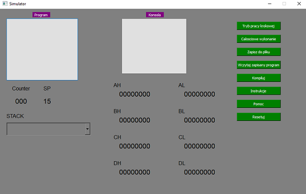

# Microprocessor-simulator

#### Project description

A software microprocessor simulator implementing selected BIOS interrupts. 

#### Design

The final window design is shown in the picture below.

